<div align="center">

<div class="logo">
<!--    <a href="https://shangchenzhou.com/projects/ProPainter/">
      <!--   </a> -->
</div>

<h1>ROSE: Remove Objects with Side Effects in Videos</h1>


<div>
    <a href='https://github.com/m1a0cX' target='_blank'>Chenxuan Miao<sup>1</sup></a>&emsp;
    <a href='https://scholar.google.com/citations?user=mZwJLeUAAAAJ&hl=en' target='_blank'>Yutong Feng<sup>2</sup></a>&emsp;
    <a href='https://lumen-relight.github.io' target='_blank'>Jianshu Zeng<sup>3</sup></a>&emsp;
    <a href='https://github.com/FaintNightmare' target='_blank'>Zixiang Gao<sup>3</sup></a>&emsp;
    <a href='' target='_blank'>Hantang Liu<sup>2</sup></a>&emsp;<br>
    <a href='https://scholar.google.com/citations?user=-rkA6ewAAAAJ&hl=en' target='_blank'>Yunfeng Yan<sup>1</sup></a>&emsp;
    <a href='https://scholar.google.com/citations?user=gVkvp1QAAAAJ&hl=en' target='_blank'>Donglian Qi<sup>1</sup></a>&emsp;
    <a href='https://xavierchen34.github.io/' target='_blank'>Xi Chen<sup>4</sup></a>&emsp;
    <a href='https://scholar.google.com/citations?user=6hTbqDEAAAAJ&hl=en' target='_blank'>Bin Wang<sup>2</sup></a>&emsp;
    <a href='https://hszhao.github.io/' target='_blank'>Hengshuang Zhao<sup>4</sup></a>&emsp;
</div>
<div>
    <sup>1</sup>Zhejiang University&emsp; 
    <sup>2</sup>KunByte AI&emsp; 
    <sup>3</sup>Peking University&emsp; 
    <sup>4</sup>The University of Hong Kong&emsp; 
</div>

<div>
    <strong>Under Review</strong>
</div>

<div>
    <h4 align="center">
        <a href="https://rose2025-inpaint.github.io/" target='_blank'>
        
        </a>
<!--         <a href="https://arxiv.org/abs/2309.03897" target='_blank'>
        
        </a> -->
<!--         <a href="https://youtu.be/92EHfgCO5-Q" target='_blank'>
        
        </a> -->
        <a href="http://arxiv.org/abs/2508.13632"></a>
        <a href='https://huggingface.co/Kunbyte/ROSE'></a>
        <a href='https://huggingface.co/spaces/Kunbyte/ROSE'></a>
        <a href='https://huggingface.co/datasets/Kunbyte/ROSE-Dataset'></a>
        <a href="https://huggingface.co/spaces/Kunbyte/ROSE" target='_blank'>
        
        </a>
<!--         <a href="https://openxlab.org.cn/apps/detail/ShangchenZhou/ProPainter" target='_blank'>
        
        </a> -->
<!--          -->
    </h4>
</div>

⭐ If ROSE is helpful to your projects, please help star this repo. Thanks! 🤗

:open_book: For more visual results, go checkout our <a href="https://rose2025-inpaint.github.io/" target="_blank">project page</a>


---

</div>

### TODO
- [x] Release checkpoints.
- [x] Release inference code.
- [x] Release gradio demo. 

  
## Results

<h3>Shadow</h3>
<table>
  <thead>
    <tr>
      <th>Masked Input</th>
      <th>Output</th>
    </tr>
  </thead>
  <tbody>
    <tr>
      <td></td>
      <td>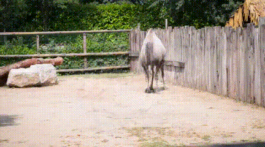 </td>
    </tr>
    <tr>
      <td>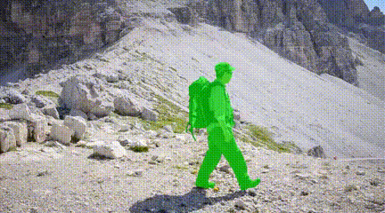</td>
      <td>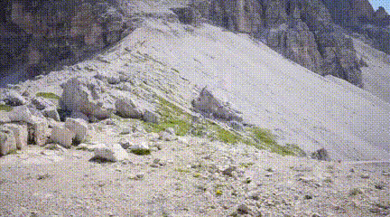</td>
    </tr>
  </tbody>
</table>

<h3>Reflection</h3>
<table>
  <thead>
    <tr>
      <th>Masked Input</th>
      <th>Output</th>
    </tr>
  </thead>
  <tbody>
    <tr>
      <td>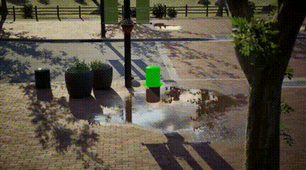</td>
      <td>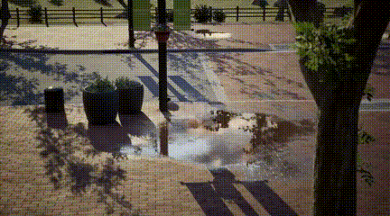</td>
    </tr>
    <tr>
      <td>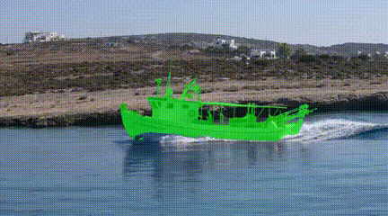</td>
      <td></td>
    </tr>
  </tbody>
</table>

<h3>Common</h3>
<table>
  <thead>
    <tr>
      <th>Masked Input</th>
      <th>Output</th>
    </tr>
  </thead>
  <tbody>
    <tr>
      <td>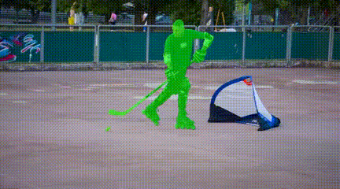</td>
      <td>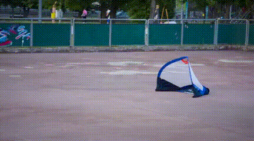</td>
    </tr>
    <tr>
      <td>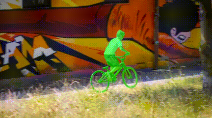</td>
      <td></td>
    </tr>
  </tbody>
</table>

<h3>Light Source</h3>
<table>
  <thead>
    <tr>
      <th>Masked Input</th>
      <th>Output</th>
    </tr>
  </thead>
  <tbody>
    <tr>
      <td>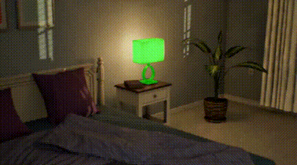</td>
      <td>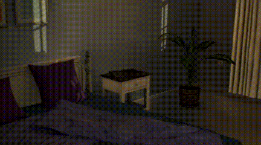</td>
    </tr>
    <tr>
      <td>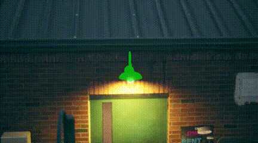</td>
      <td>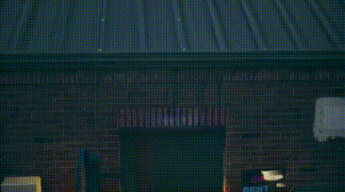</td>
    </tr>
  </tbody>
</table>

<h3>Translucent</h3>
<table>
  <thead>
    <tr>
      <th>Masked Input</th>
      <th>Output</th>
    </tr>
  </thead>
  <tbody>
    <tr>
      <td>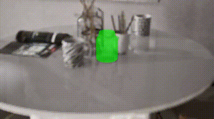</td>
      <td>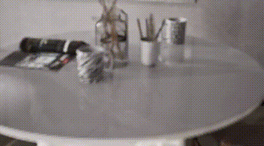</td>
    </tr>
    <tr>
      <td>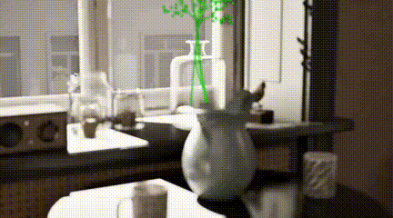</td>
      <td>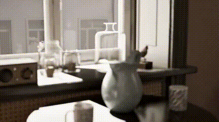</td>
    </tr>
  </tbody>
</table>

<h3>Mirror</h3>
<table>
  <thead>
    <tr>
      <th>Masked Input</th>
      <th>Output</th>
    </tr>
  </thead>
  <tbody>
    <tr>
      <td></td>
      <td>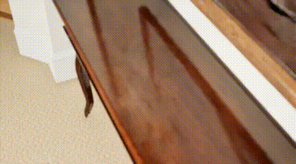</td>
    </tr>
    <tr>
      <td>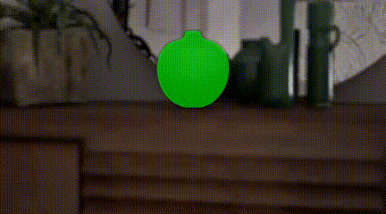</td>
      <td>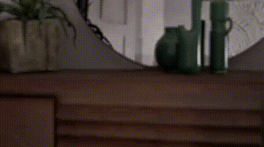</td>
    </tr>
  </tbody>
</table>


## Overview
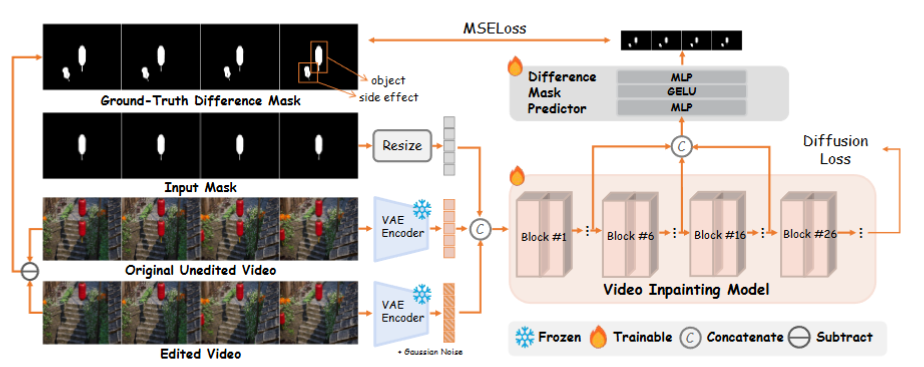


## Dependencies and Installation

1. Clone Repo

   ```bash
   git clone https://github.com/Kunbyte-AI/ROSE.git
   ```

2. Create Conda Environment and Install Dependencies

   ```bash
   # create new anaconda env
   conda create -n rose python=3.12 -y
   conda activate rose

   # install python dependencies
   pip3 install -r requirements.txt
   ```

   - CUDA = 12.4
   - PyTorch = 2.6.0
   - Torchvision = 0.21.0
   - Other required packages in `requirements.txt`

## Get Started
### Prepare pretrained models

We use pretrained [`Wan2.1-Fun-1.3B-InP`](https://huggingface.co/alibaba-pai/Wan2.1-Fun-1.3B-InP) as our base model. And during training, we only train the WanTransformer3D part and keep other parts frozen. You can download the weight of Transformer3D of ROSE from this [`link`](https://huggingface.co/Kunbyte/ROSE). 

And for gradio demo, we use the pretrained [`SAM`](https://github.com/facebookresearch/segment-anything) for generating masks. 


The complete weight directory structure will be arranged as:
```
weights
 ├── transformer
   ├── config.json
   ├── diffusion_pytorch_model.safetensors
 ├── cutie-base-mega.pth
 ├── sam_vit_h_4b8939.pth
 ├── download_sam_ckpt.sh
```
Also, it's necessary to prepare the base model in the models directory. You can download the Wan2.1-Fun-1.3B-InP base model from this [`link`](https://huggingface.co/alibaba-pai/Wan2.1-Fun-1.3B-InP).

The [`models`](./models) will be arranged like this:
```
models
 ├── Wan2.1-Fun-1.3B-InP
   ├── google
     ├── umt5-xxl
       ├── spiece.model
       ├── special_tokens_map.json
           ...
   ├── xlm-roberta-large
     ├── sentencepiece.bpe.model
     ├── tokenizer_config.json
         ...
 ├── config.json
 ├── configuration.json
 ├── diffusion_pytorch_model.safetensors
 ├── models_clip_open-clip-xlm-roberta-large-vit-huge-14.pth
 ├── models_t5_umt5-xxl-enc-bf16.pth
 ├── Wan2.1_VAE.pth
```

### 🏂 Quick test
We provide some examples in the [`data/eval`](./inputs) folder. 
Run the following commands to try it out:
```shell
python inference.py 
```
```
Usage:

python inference.py [options]

Options:
  --validation_videos  Path(s) to input videos 
  --validation_masks   Path(s) to mask videos 
  --validation_prompts Text prompts (default: [""])
  --output_dir         Output directory 
  --video_length       Number of frames per video (It needs to be 16n+1.)
  --sample_size        Frame size: height width (default: 480 720)

```

#### 💃🏻 Interactive Demo

We also provide an interactive demo for object removal, allowing users to select any object they wish to remove from a video. You can try the demo on [Hugging Face](https://huggingface.co/spaces/Kunbyte/ROSE) or run it [locally](https://github.com/Kunbyte-AI/ROSE/tree/main/hugging_face). 

<!-- <div align="center">
  
</div> -->
<!-- 
*Please note that the demo's interface and usage may differ from the GIF animation above. For detailed instructions, refer to the [user guide](https://github.com/sczhou/ProPainter/blob/main/web-demos/hugging_face/README.md).* -->


<!-- ## Dataset preparation
<table>
<thead>
  <tr>
    <th>Dataset</th>
    <th>YouTube-VOS</th>
    <th>DAVIS</th>
  </tr>
</thead>
<tbody>
  <tr>
    <td>Description</td>
    <td>For training (3,471) and evaluation (508)</td>
    <td>For evaluation (50 in 90)</td>
  <tr>
    <td>Images</td>
    <td> [<a href="https://competitions.codalab.org/competitions/19544#participate-get-data">Official Link</a>] (Download train and test all frames) </td>
    <td> [<a href="https://data.vision.ee.ethz.ch/csergi/share/davis/DAVIS-2017-trainval-480p.zip">Official Link</a>] (2017, 480p, TrainVal) </td>
  </tr>
  <tr>
    <td>Masks</td>
    <td colspan="2"> [<a href="https://drive.google.com/file/d/1dFTneS_zaJAHjglxU10gYzr1-xALgHa4/view?usp=sharing">Google Drive</a>] [<a href="https://pan.baidu.com/s/1JC-UKmlQfjhVtD81196cxA?pwd=87e3">Baidu Disk</a>] (For reproducing paper results; provided in <a href="https://arxiv.org/abs/2309.03897">ProPainter</a> paper) </td>
  </tr>
</tbody>
</table>

The training and test split files are provided in `datasets/<dataset_name>`. For each dataset, you should place `JPEGImages` to `datasets/<dataset_name>`. Resize all video frames to size `432x240` for training. Unzip downloaded mask files to `datasets`.

The `datasets` directory structure will be arranged as: (**Note**: please check it carefully)
```
datasets
   |- davis
      |- JPEGImages_432_240
         |- <video_name>
            |- 00000.jpg
            |- 00001.jpg
      |- test_masks
         |- <video_name>
            |- 00000.png
            |- 00001.png   
      |- train.json
      |- test.json
   |- youtube-vos
      |- JPEGImages_432_240
         |- <video_name>
            |- 00000.jpg
            |- 00001.jpg
      |- test_masks
         |- <video_name>
            |- 00000.png
            |- 00001.png
      |- train.json
      |- test.json   
```

## Training
Our training configures are provided in [`train_flowcomp.json`](./configs/train_flowcomp.json) (for Recurrent Flow Completion Network) and [`train_propainter.json`](./configs/train_propainter.json) (for ProPainter).

Run one of the following commands for training:
```shell
 # For training Recurrent Flow Completion Network
 python train.py -c configs/train_flowcomp.json
 # For training ProPainter
 python train.py -c configs/train_propainter.json
```
You can run the **same command** to **resume** your training.

To speed up the training process, you can precompute optical flow for the training dataset using the following command:
```shell
 # Compute optical flow for training dataset
 python scripts/compute_flow.py --root_path <dataset_root> --save_path <save_flow_root> --height 240 --width 432
```

## Evaluation
Run one of the following commands for evaluation:
```shell
 # For evaluating flow completion model
 python scripts/evaluate_flow_completion.py --dataset <dataset_name> --video_root <video_root> --mask_root <mask_root> --save_results
 # For evaluating ProPainter model
 python scripts/evaluate_propainter.py --dataset <dataset_name> --video_root <video_root> --mask_root <mask_root> --save_results
```

The scores and results will also be saved in the `results_eval` folder.
Please `--save_results` for further [evaluating temporal warping error](https://github.com/phoenix104104/fast_blind_video_consistency#evaluation). -->


## Citation

   If you find our repo useful for your research, please consider citing our paper:

   ```bibtex
   @inproceedings{
   }
   ```

## Contact
If you have any questions, please feel free to reach me out at weiyuchoumou526@gmail.com. 

## Acknowledgement

This code is based on [Wan2.1-Fun-1.3B-Inpaint](https://github.com/aigc-apps/VideoX-Fun) and some code are brought from [ProPainter](https://github.com/sczhou/ProPainter). Thanks for their awesome works！
